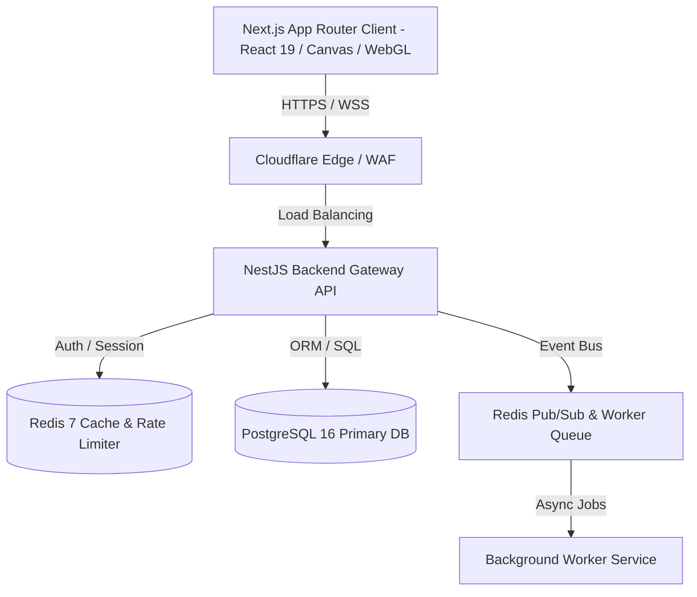
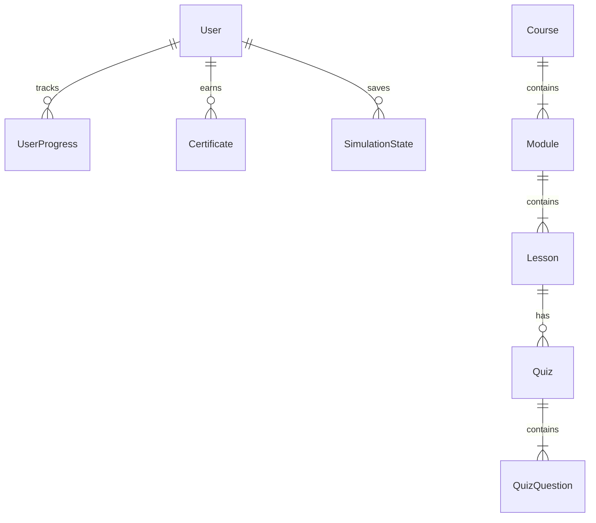
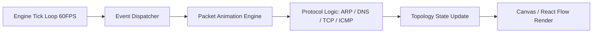
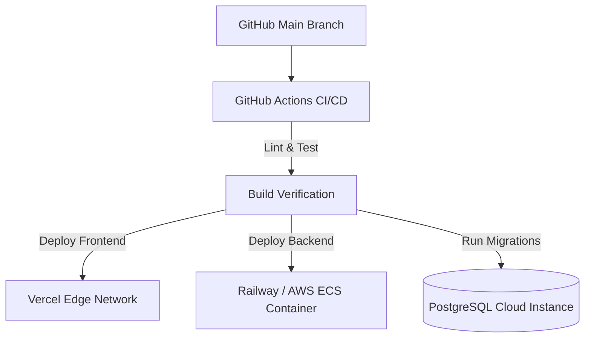
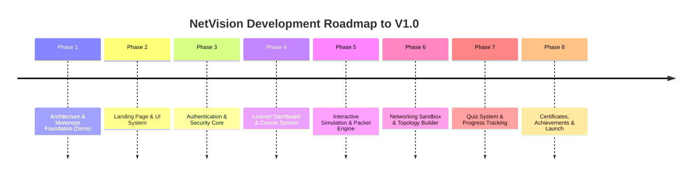

# NetVision Master Architecture Blueprint & Engineering Specification

> **Version**: 1.0.0-ARCH  
> **Status**: APPROVED ARCHITECTURE  
> **Target Scale**: 100,000+ Active Concurrent Learners  
> **Lead Architect**: NetVision Senior Engineering Team  

---

## Executive Overview

NetVision is designed as an enterprise-grade, high-performance visual learning environment for computer networking ("Duolingo + Cisco Packet Tracer + Brilliant.org"). This document defines the technical architecture, domain boundaries, security guarantees, performance targets, and long-term scaling pathways for NetVision.

---

## 1. Overall System Architecture

### Rationale & Trade-off Analysis
- **Why Selected**: Decoupled Monorepo split between SSR/Edge Frontend (Next.js) and Event-Driven REST/WebSocket API Gateway (NestJS). Allows rich interactive client-side simulation while ensuring server-authoritative evaluation for quizzes and progress.
- **Alternatives Considered**:
  1. *Monolithic Next.js (Server Actions only)*: Rejected due to difficulty in handling real-time WebSocket packet orchestration and server-side worker queues.
  2. *Microservices Grid*: Rejected for initial phase due to operational overhead; monolithic NestJS allows clean module boundaries that can be extracted later.
- **Pros**: Clear separation of concerns, high frontend rendering speed, robust backend type safety, simple local development via Docker Compose.
- **Cons**: Requires managing two deployment targets (Vercel/Cloudflare for Frontend, Railway/AWS for Backend).
- **Best Practices**: Maintain strict boundary contracts between frontend and backend via shared TypeScript DTO interfaces in `@netvision/shared`.
- **Future Scalability**: NestJS modules (e.g., `simulations`, `quiz`) can be extracted into standalone microservices behind an API Gateway as traffic scales beyond 50,000 active WebSocket connections.

---

## 2. Frontend Architecture

### Architecture Overview
Next.js App Router (React 18/19), TypeScript, Tailwind CSS, Framer Motion for UI micro-interactions, React Flow (`@xyflow/react`) for topology rendering, and Canvas API for high-frequency packet particle movement.

### Rationale & Trade-off Analysis
- **Why Selected**: App Router provides hybrid rendering (RSC for static course content and SEO, Client Components for interactive simulations).
- **Alternatives Considered**: SPA via Vite + React. Rejected due to poor SEO for course catalog and landing pages.
- **Pros**: Next-gen image optimization, route-based code splitting, fast initial page loads (Lighthouse > 95 target).
- **Cons**: App Router learning curve and strict server vs. client boundaries.
- **Best Practices**: Keep client state local using Zustand slices; avoid unnecessary top-level re-renders during high-frequency simulation ticks.
- **Future Scalability**: WebGL/Three.js integration fallback when topology nodes exceed 100 simultaneous devices.

---

## 3. Backend Architecture

### Architecture Overview
NestJS Framework structured in feature-driven modules (`Auth`, `Users`, `Courses`, `Simulations`, `Sandbox`, `Quiz`, `Progress`, `Certificates`, `Admin`).

### Rationale & Trade-off Analysis
- **Why Selected**: Out-of-the-box support for TypeScript, Dependency Injection, Guards, Interceptors, and Pipes. Ensures uniform patterns across backend modules.
- **Alternatives Considered**: Express.js/Fastify raw setup. Rejected due to lack of standard architecture structure leading to tech debt.
- **Pros**: Enforces SOLID design principles, maintainable dependency graph, seamless integration with Prisma and Passport JWT.
- **Cons**: Slightly higher memory footprint than raw Fastify.
- **Best Practices**: Keep Controllers thin; business logic stays inside Services; sanitize inputs with Class-Validator pipes.
- **Future Scalability**: Easy conversion of NestJS modules into gRPC microservices.

---

## 4. Database Architecture

### Architecture Overview
PostgreSQL 16 primary relational database managed via Prisma ORM. Redis 7 for session state, rate limiting, and simulation snapshot caching.

### Rationale & Trade-off Analysis
- **Why Selected**: Relational integrity is mandatory for course progression, certificates, and user achievements. Prisma provides compile-time type safety.
- **Alternatives Considered**: MongoDB / NoSQL. Rejected because course hierarchies and user progress are inherently relational.
- **Pros**: Strict schema validation, atomic transactions, automatic migrations via Prisma.
- **Cons**: SQL migrations require planning for zero-downtime deployments.
- **Best Practices**: Index foreign keys (`userId`, `lessonId`, `courseId`), use JSONB columns for dynamic simulation topology snapshots.
- **Future Scalability**: Read-replicas for PostgreSQL when read query load increases; Redis cluster for caching.

---

## 5. Authentication Flow

### Rationale & Trade-off Analysis
- **Why Selected**: Argon2id password hashing + Short-lived JWT Access Tokens (15 min) + HttpOnly, SameSite=Strict Refresh Tokens (7 days).
- **Alternatives Considered**: Pure OAuth / Third-party (Auth0, Firebase). Rejected to maintain complete data ownership, zero vendor lock-in, and cost control for 100,000+ users.
- **Pros**: Protection against XSS (HttpOnly cookie for refresh token) and CSRF (SameSite header + CSRF tokens).
- **Cons**: Self-managed token rotation logic required.
- **Best Practices**: Store hashed refresh tokens in Redis for instant token revocation (e.g., global logout).
- **Future Scalability**: Easy addition of OAuth2 (GitHub/Google login) using Passport strategies.

---

## 6. Authorization Flow

### Rationale & Trade-off Analysis
- **Why Selected**: Role-Based Access Control (RBAC) with hierarchical permissions (`STUDENT` < `TEACHER` < `ADMIN`).
- **Alternatives Considered**: ABAC (Attribute-Based Access Control). Rejected as overly complex for initial platform needs.
- **Pros**: Lightweight runtime overhead, predictable security guards.
- **Cons**: Adding granular sub-permissions requires updating role definitions.
- **Best Practices**: NestJS `@Roles()` decorator combined with `RolesGuard` applied globally or at controller level.
- **Future Scalability**: Migration to CASL for granular resource-level permission checks if multi-tenant school features are introduced.

---

## 7. API Structure

### Rationale & Trade-off Analysis
- **Why Selected**: RESTful JSON API for core CRUD operations combined with WebSocket (Socket.IO / WebSockets) for real-time collaborative sandbox sessions and simulation streaming.
- **Alternatives Considered**: GraphQL. Rejected due to complexity in caching and payload size overhead for simple progress endpoints.
- **Pros**: Clear HTTP verb semantics (`GET`, `POST`, `PUT`, `DELETE`), standard status codes, simple caching headers.
- **Cons**: REST requires multiple requests for nested resources (mitigated via nested endpoint payloads).
- **Best Practices**: Versioning via URL path (`/api/v1/...`), centralized API response wrapper `{ success: true, data: {}, timestamp: "..." }`.
- **Future Scalability**: Swagger / OpenAPI auto-generation for external API developer portal.

---

## 8. Folder Structure

### Rationale & Trade-off Analysis
- **Why Selected**: Workspace Monorepo split by responsibility:
  - `frontend/`: Next.js frontend pages, components, features, hooks, stores.
  - `backend/`: NestJS modules, database service, auth middleware.
  - `packages/`: `@netvision/shared` for domain types, DTOs, and protocol constants.
- **Alternatives Considered**: Polyrepo (separate git repositories). Rejected due to drift between API specs and frontend interfaces.
- **Pros**: Single git commit cross-stack changes, shared code reusability.
- **Cons**: Monorepo build times increase without build caching (mitigated via Turborepo/npm workspaces).

---

## 9. State Management

### Rationale & Trade-off Analysis
- **Why Selected**: Dual-layer state architecture:
  1. *Zustand* for global UI state, active user session, and high-performance simulation canvas state.
  2. *React Query / Native Fetching* for server state caching and revalidation.
- **Alternatives Considered**: Redux Toolkit. Rejected due to boilerplate verbosity and slower performance during 60 FPS animation ticks.
- **Pros**: Minimal bundle size (Zustand ~1kb), un-opinionated state slicing, zero context provider re-rendering overhead.
- **Cons**: Developer discipline required to prevent unstructured store mutations.
- **Best Practices**: Separate simulation store from UI navigation store; keep state shallow.

---

## 10. Simulation Engine Architecture

### Rationale & Trade-off Analysis
- **Why Selected**: Event-driven Discrete Event Simulation (DES) model running in Web Worker or client event loop.
- **Alternatives Considered**: Server-computed frames streamed via video/canvas. Rejected due to immense server cost and latency.
- **Pros**: Zero server CPU load during animation playback, smooth 60 FPS client rendering.
- **Cons**: Client logic validation must be re-executed server-side for graded lab submissions.
- **Best Practices**: Decouple packet physics/movement from protocol state machine.

---

## 11. Sandbox Architecture

### Rationale & Trade-off Analysis
- **Why Selected**: Graph-based topology model powered by React Flow for layout and custom Canvas layer for packet movement overlay.
- **Alternatives Considered**: Raw SVG element manipulation. Rejected due to complex zoom/pan/drag performance degradation.
- **Pros**: Built-in drag-and-drop, node custom styling, edge routing, zoom/pan controls out of the box.
- **Cons**: High node counts (100+) require custom rendering optimization.
- **Best Practices**: Use memoized node and edge components; batch topology updates.

---

## 12. Performance Strategy

- **Target Metrics**: Lighthouse Performance Score > 95, First Contentful Paint (FCP) < 1.0s, Time to Interactive (TTI) < 2.0s.
- **Techniques**:
  1. Automatic route-based code splitting & image optimization via Next.js.
  2. Dynamic lazy loading for heavy canvas components (`@xyflow/react`).
  3. Gzip / Brotli compression at Cloudflare Edge.
  4. Response caching via Redis for static course metadata.

---

## 13. Security Strategy

- **OWASP Top 10 Protections**:
  - *Injection*: Parameterized queries enforced via Prisma ORM.
  - *Broken Auth*: Argon2id password hashing, HTTP-Only cookies, short JWT lifetime.
  - *XSS*: Content Security Policy (CSP) headers via Helmet, React auto-escaping.
  - *CSRF*: SameSite=Strict cookies + custom header verification.
  - *Rate Limiting*: Redis-backed rate limiting on auth endpoints (5 req/min).

---

## 14. Scalability Strategy

- **Stateless Backend**: NestJS application servers carry no local session state; all state lives in Redis / PostgreSQL.
- **Database Scaling**: Read-replicas for PostgreSQL read traffic; Redis Cluster for cache distribution.
- **CDN Offload**: Static assets, lesson videos/diagrams cached globally at Cloudflare Edge.

---

## 15. Deployment Architecture

---

## 16. Error Handling Strategy

- **Frontend**: Global React Error Boundaries + Toast notifications for API failures.
- **Backend**: Centralized NestJS Exception Filters returning standardized JSON error schemas.

---

## 17. Logging Strategy

- Structured JSON logging using NestJS `Logger` / Pino.
- Log Levels: `ERROR`, `WARN`, `INFO`, `DEBUG`.

---

## 18. Monitoring Strategy

- **Health Checks**: `/api/v1/health` endpoint monitoring Database & Redis responsiveness.
- **Performance Tracing**: Integration readiness for Sentry error tracking.

---

## 19. Testing Strategy

- **Unit Testing**: Jest for frontend helper functions and backend service methods.
- **E2E Testing**: Playwright for complete browser user journeys.

---

## 20. Git Workflow & Branching Strategy

- **Branching Model**: GitHub Flow (`main`, `feature/*`, `fix/*`).
- **Commits**: Conventional Commits standard (`feat:`, `fix:`, `docs:`, `style:`, `refactor:`).

---

# 🛣️ Master Development Roadmap (Day 1 → Version 1.0)

### Phase 1: Monorepo Foundation & Architecture (COMPLETED)
- System Architecture, Database Schema, Monorepo Setup, Docker Compose.

### Phase 2: Landing Page & UI Design System (Current Focus)
- Hero section with interactive packet animation preview.
- Feature showcase, interactive demo card, responsive layout, footer.

### Phase 3: Authentication & Security Core
- User registration, login, JWT token handling, password reset, RBAC guards.

### Phase 4: Learner Dashboard & Course Catalog
- User dashboard, progress stats, course list, module viewer.

### Phase 5: Interactive Simulation Engine
- Packet visualizer for ARP, DNS, TCP Handshake, ICMP Ping, Routing.

### Phase 6: Networking Sandbox Lab
- Drag-and-drop canvas, device configuration modals, connection links, break/repair tools.

### Phase 7: Quizzes & Achievements System
- Interactive quizzes, instant feedback, scoring engine, achievements unlocking.

### Phase 8: Certificates, Admin Dashboard & V1.0 Launch
- Dynamic SVG certificate generator, admin panel, Lighthouse >95 optimization, launch deployment.
