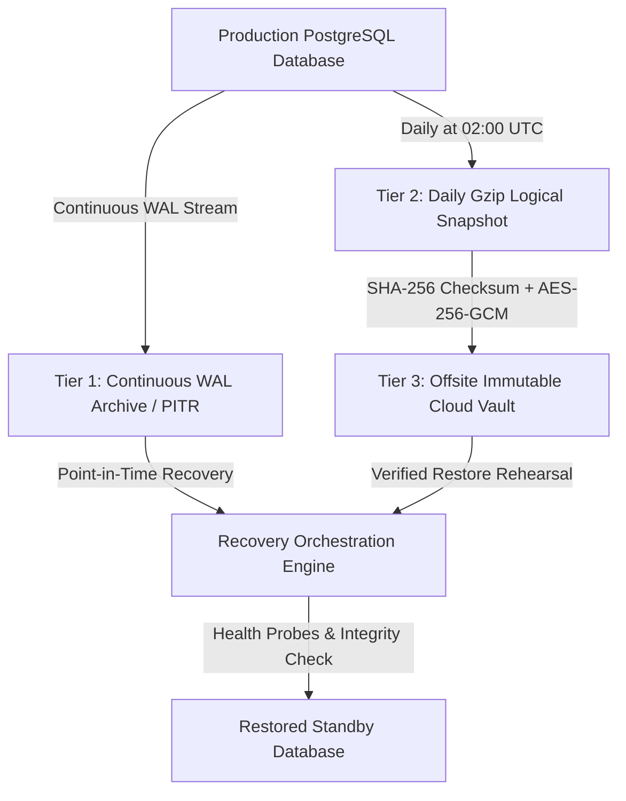

# NetVision — Disaster Recovery, Data Lifecycle & Backup Architecture

**Document Version**: 1.0.0 (Production Release)  
**Classification**: Engineering Standard & Operational Runbook  
**SLA Targets**: **RPO < 15 Minutes** | **RTO < 30 Minutes** | **High Availability: 99.95%**  
**Compliance Standards**: SOC 2 Type II, ISO 27001 (A.12.1.3 Backup, A.12.3.1 Information Backup), GDPR (Art. 17 Right to Erasure, Art. 32 Security of Processing)

---

## 1. Executive Summary & Objectives

NetVision delivers mission-critical networking education, hands-on simulation sandboxes, and cryptographic certification credentials. The platform's data layer must be **resilient to catastrophic infrastructure failure, corruption, accidental deletion, and credential compromise** while maintaining strict privacy and regulatory governance.

### Core Recovery Objectives

| Metric | Target SLA | Strategy / Enabling Mechanism |
| :--- | :--- | :--- |
| **RPO (Recovery Point Objective)** | **&lt; 15 Minutes** | Continuous Write-Ahead Logging (WAL) streaming and Point-in-Time Recovery (PITR) snapshots. |
| **RTO (Recovery Time Objective)** | **&lt; 30 Minutes** | Automated container provisioning, parallel snapshot restoration, and health probe verification. |
| **Backup Cryptographic Integrity** | **100% Verification** | Cryptographic SHA-256 manifest generation for every backup archive; weekly automated restore verification. |
| **Encryption Standard** | **AES-256-GCM / TLS 1.3** | Envelope encryption at rest; TLS 1.3 Strict Transport Security in transit; zero plaintext backups. |
| **Public Credential Immutability** | **Permanent** | Certificate records and verification codes are write-once, tamper-evident, and permanently preserved. |

---

## 2. Platform Data Lifecycle & Retention Governance

NetVision categorizes all persistent and ephemeral data into 12 distinct functional domains. Each domain is governed by explicit retention semantics across the complete lifecycle: **Creation &rarr; Active Use &rarr; Modification &rarr; Archival &rarr; Deletion**.

### 2.1 Entity Lifecycle Matrix

| Entity Domain | Creation Trigger | Active Usage Pattern | Modification Constraints | Archival Policy | Retention Period | Deletion Mechanism |
| :--- | :--- | :--- | :--- | :--- | :--- | :--- |
| **Users & Profiles** | Self-registration (Email/Pass) or OAuth federated login | Authentication, dashboard rendering, role authorization | Learner updates name/bio; admin updates role; audit logs immutable | Inactive accounts (>24 mo) notified & moved to cold tier | Duration of active learner relationship + 30 days post-closure | `SOFT_DELETE_ANONYMIZE` (PII erased; transcripts decoupled) |
| **Sessions & Refresh Tokens** | Successful login or token rotation | Bearer token validation, refresh family tracking | Token reuse triggers family revocation; revoked tokens store TTL | None (ephemeral security state) | Max token lifetime: 7 days post-revocation | `TTL_EXPIRE` (Pruned by automated periodic timer every 60s) |
| **Email Verification OTPs** | Registration or verification resend request | 6-digit cryptographic hash validation (3-attempt rate limit) | Attempt counter incremented; invalidated upon verification | None | 15-minute expiration; hard purged after 24 hours | `HARD_DELETE` (Automated cleanup) |
| **Password Reset Tokens** | Forgot password submission | Single-use token hash validation | Marked `used: true` immediately upon password reset | None | 1-hour expiration; hard purged after 24 hours | `HARD_DELETE` (Automated cleanup) |
| **Labs & Curriculum** | Curriculum deployment, DB migration or seed | Read-only learner access, interactive topology instantiation | Schema migrations only; backward-compatible lesson slugs | Superseded versions flagged as deprecated | Permanent (Core educational asset) | `IMMUTABLE_PERMANENT` |
| **Simulation Sessions** | Learner launches sandbox lab or interactive topology | Dynamic CLI commands, packet capture, interface telemetry | State mutated per command; auto-terminates upon timeout | Completed session telemetry retained for learner review | Active 1–4 hours; debug logs purged after 30 days | `TTL_EXPIRE` (Expired status after 1h; purge after 30d) |
| **Quizzes & Questions** | Curriculum publishing / admin content deployment | Randomized assessment assembly, scoring evaluation | Content updates via versioned migrations; answer keys unexposed | Historical questions retained to validate prior attempts | Permanent | `IMMUTABLE_PERMANENT` |
| **Quiz Attempts** | Learner submits quiz for grading | Score calculation, mastery tracking, concept weakness analysis | Immutable once graded; re-attempt creates new unique record | Cold-archived after 3 years of learner inactivity | Duration of learner enrollment + 3 years | `SOFT_DELETE_ANONYMIZE` |
| **Lab Attempts** | Learner validates topology configuration against rubric | Automated topology state validation, hint scoring, grading | Immutable once evaluated; includes executed command stream | Cold-archived after 3 years of learner inactivity | Duration of learner enrollment + 3 years | `SOFT_DELETE_ANONYMIZE` |
| **Certifications & Credentials** | Passing score on theoretical & practical exams | Certificate rendering, public verification, employer queries | Strictly immutable. Revocation sets status `REVOKED` with audit trail | Permanent cryptographic retention | Permanent (Preserved to prevent counterfeit claims) | `IMMUTABLE_PERMANENT` |
| **Verification Records** | Certificate issuance generates unique `verificationCode` | Public query at `/certifications/verify/:code` (zero auth) | Strictly immutable; unique database index | Permanent live accessibility | Permanent | `IMMUTABLE_PERMANENT` |
| **Telemetry & Metrics** | HTTP requests, auth events, lab actions, health probes | Real-time monitoring, alert threshold evaluation, latency percentiles | In-memory ring buffer (last 1,000 requests) & rolling windows | Daily metric rollups aggregated for 14 days | Hot: in-memory ring buffer; Warm: 14 days rollups | `TTL_EXPIRE` (Rolling buffer auto-eviction) |
| **System & Security Logs** | Security events, token reuse detection, auth failures | Intrusion detection, post-incident forensics, SIEM compliance | Append-only; PII, JWTs, and answers strictly redacted | Compressed and moved to cold storage after 30 days | Hot: 30 days; Cold: 90 days; then purged | `HARD_DELETE` (S3 lifecycle expiration) |

### 2.2 Privacy & GDPR Right to Erasure (Anonymization Protocol)

When a learner exercises their GDPR Article 17 "Right to be Forgotten":
1. **PII Scrubbing**: `User.email`, `User.fullName`, `User.avatarUrl`, and `User.username` are purged and replaced with non-identifiable random hashes (e.g., `anonymized-usr-9812@netvision.anonymized`).
2. **Credential Integrity Safeguard**: Under GDPR Article 6(1)(f) (Legitimate Interest for Fraud Prevention), issued certificates, credentials, and verification hashes (`verificationCode`, `credentialId`) are preserved in an anonymized state (`recipientName: "Anonymized Graduate"`). This prevents bad actors from claiming valid credentials under deleted identities or forging duplicate credentials.
3. **Session Termination**: All active refresh tokens, sessions, and oauth bindings are immediately revoked.

---

## 3. Multi-Tier Backup Architecture

NetVision implements a 3-tier defense-in-depth backup topology to prevent single-point-of-failure vulnerabilities.



### 3.1 Backup Tiers

1. **Tier 1: Continuous WAL Archiving & Point-In-Time-Recovery (PITR)**
   - **Mechanism**: Neon / PostgreSQL Write-Ahead Logging (WAL) streaming.
   - **Frequency**: Continuous transaction delta replication.
   - **Recovery Window**: Any second within the preceding 7 days.
   - **RPO**: &lt; 5 minutes (typically &lt; 30 seconds).

2. **Tier 2: Daily Full Compressed Logical Snapshot**
   - **Mechanism**: Automated `pg_dump` with schema, tables, and sequence state (`--clean --if-exists --no-owner --no-privileges`).
   - **Frequency**: Daily at 02:00 UTC (off-peak).
   - **Compression**: Level 9 Gzip compression (typical 75% size reduction).
   - **Integrity**: SHA-256 cryptographic digest manifest (`backup-<date>.sql.gz.sha256`).

3. **Tier 3: Offsite Immutable Cloud Vault**
   - **Mechanism**: Replicated to AWS S3 Glacier / Cloudflare R2 with Object Lock (WORM: Write Once, Read Many).
   - **Encryption**: AES-256-GCM with customer-managed KMS key.
   - **Ransomware Defense**: Object Lock prevents deletion or overwrite even by root cloud credentials for the duration of the retention policy.

### 3.2 Retention Schedule

- **Daily Backups**: Retained for **7 days**.
- **Weekly Backups**: Retained for **4 weeks**.
- **Monthly Backups**: Retained for **12 months**.
- **Annual Compliance Snapshots**: Retained for **7 years** (SOC 2 and academic record verification requirement).

---

## 4. Rehearsal & Verification Protocol

A backup that has never been restored is not a backup. NetVision enforces continuous, automated validation:

### 4.1 Automated Synthetic Restore Rehearsal
- **Frequency**: Automated on every CI release gate and weekly scheduled task.
- **Execution Script**: `backend/scripts/rehearse-disaster-recovery.ts`.
- **Validation Scope**:
  1. Full export serialization of all 12 entities.
  2. SHA-256 checksum and AES-256-GCM encryption verification.
  3. Single-bit cryptographic tamper detection (verifying modified backups are rejected).
  4. Simulation of all 6 disaster scenarios in an isolated sandbox.
  5. Measurement of RPO (&lt; 15 min) and RTO (&lt; 30 min) compliance.

### 4.2 Production Dry-Run Pruning Rehearsal
- Platform administrators can trigger non-destructive retention evaluations directly from the Admin Dashboard or CLI:
  ```bash
  curl -X POST https://api.netvision.edu/api/v1/admin/lifecycle/prune?dryRun=true \
    -H "Authorization: Bearer <ADMIN_JWT>"
  ```
  Returns exact counts of eligible expired OTPs, expired reset tokens, and expired sandbox sessions without executing any write mutations.

---

## 5. Standard Operating Procedures (SOPs) for 6 Disaster Scenarios

### Scenario 1: Database Corruption

> **Severity**: CRITICAL (P1)  
> **Detection**: Automated integrity checker failure, Prisma `P2025` or `P2010` query crashes, elevated 5xx alert trigger.

```
[ALERT: DB_CORRUPTION]
      │
      ▼
1. Isolate Database (Revoke App DB user write permissions)
      │
      ▼
2. Provision Replacement PostgreSQL Instance
      │
      ▼
3. Download Latest Verified Backup from Immutable Vault (Tier 3)
      │
      ▼
4. Verify SHA-256 Checksum (`sha256sum -c backup.sql.gz.sha256`)
      │
      ▼
5. Decrypt and Restore Database (`gunzip -c backup.sql.gz | psql $RESTORE_URL`)
      │
      ▼
6. Replay WAL Transactions up to the Corruption Timestamp (PITR)
      │
      ▼
7. Execute Automated Health & Schema Validation (`/health/ready` + test-product-correctness.ts)
      │
      ▼
8. Update DATABASE_URL and Restore Traffic
```

---

### Scenario 2: Accidental Deletion

> **Severity**: HIGH (P2)  
> **Detection**: Unexpected record count drops in `/admin/dashboard`, audit alert `UNEXPECTED_BULK_DELETE`.

1. **Immediate Action**: Halt automated cleanup crons and read-replica replication lag to prevent propagation.
2. **Determine Point of Deletion**: Review database audit logs / CloudTrail to identify exact timestamp $T_{del}$ of the errant `DROP` or `DELETE` statement.
3. **Execute Point-in-Time Recovery (PITR)**:
   - Request restoration to $T_{del} - 60\text{ seconds}$ via PostgreSQL WAL replay.
   - Restore into an isolated schema or temporary database instance.
4. **Table-Level Export & Merge**:
   - Extract deleted records from the PITR instance:
     ```bash
     pg_dump -t certificates -t exam_attempts $PITR_DATABASE_URL > recovered_records.sql
     ```
   - Import missing records into the primary database with `ON CONFLICT DO NOTHING`.
5. **Verify Data Consistency**:
   - Verify zero lost certifications or learner achievements.
   - Validate learner access and public verification endpoints.

---

### Scenario 3: Deployment Failure

> **Severity**: HIGH (P2)  
> **Detection**: Kubernetes/Render container crash loop, HTTP 502/503 spike, failed readiness probe (`/health/ready`).

1. **Automated Rollback**:
   - NetVision deployment pipelines use blue/green container strategies.
   - If `/health/ready` fails 3 consecutive probes during traffic migration, routing automatically reverts 100% to the previous active deployment image.
2. **Manual Rollback Command**:
   ```bash
   # Docker / Container Registry
   docker tag netvision-backend:previous netvision-backend:latest
   docker compose up -d --no-deps backend
   ```
3. **Post-Rollback Triage**:
   - Inspect build artifacts and startup logs for runtime exceptions or missing environment variables.
   - Verify database migrations did not introduce breaking column drops.

---

### Scenario 4: Application Instance Loss

> **Severity**: MEDIUM (P3)  
> **Detection**: Instance heartbeat loss, CloudWatch / Grafana alert `INSTANCE_OFFLINE`.

1. **Architectural Resilience**:
   - NetVision backend nodes are **completely stateless**.
   - Authenticated JWT verification relies on stateless cryptographic signatures.
   - Token revocation is backed by persistent Redis / distributed storage, ensuring revocation states are shared across all instances.
2. **Failover Execution**:
   - The upstream reverse proxy (Cloudflare / ALB / Nginx) automatically removes the unresponsive node from the upstream pool within 3 seconds.
   - Traffic is transparently routed to surviving replicas with **zero session interruption**.
3. **Instance Replacement**:
   - Auto-scaling group or orchestrator restarts the failed container automatically.

---

### Scenario 5: Secret Rotation

> **Severity**: MEDIUM (P3) Planned / HIGH (P1) if compromise suspected.  
> **Objective**: Zero-downtime secret rotation without logging out active legitimate learners.

NetVision supports a **Dual-Key Grace Window** protocol for secret rotations:

1. **Phase 1: Dual-Key Verification Window**:
   - Configure backend with primary key `JWT_SECRET_NEW` and secondary key `JWT_SECRET_LEGACY`.
   - New tokens are signed exclusively with `JWT_SECRET_NEW`.
   - Inbound requests signed with either key are validated as valid.
2. **Phase 2: Compromised Session Invalidation**:
   - If rotation was triggered by credential exposure, trigger bulk revocation:
     ```bash
     curl -X POST https://api.netvision.edu/api/v1/auth/revoke-all \
       -H "Authorization: Bearer <ADMIN_TOKEN>"
     ```
3. **Phase 3: Retirement of Legacy Key**:
   - After 7 days (maximum token lifetime), remove `JWT_SECRET_LEGACY`.
   - All tokens must now originate from `JWT_SECRET_NEW`.

---

### Scenario 6: Schema Migration Failure

> **Severity**: HIGH (P2)  
> **Detection**: Prisma migration error during deployment (`prisma migrate deploy` exit code != 0).

1. **Transactional DDL Protection**:
   - All Prisma migrations run inside explicit PostgreSQL transactions (`BEGIN ... COMMIT`).
   - If an error occurs (e.g., column type incompatibility or table lock contention), PostgreSQL rolls back the transaction atomically, leaving the schema in its prior valid state.
2. **Remediation Steps**:
   - Inspect migration error:
     ```bash
     npx prisma migrate status
     ```
   - Resolve migration drift:
     ```bash
     npx prisma migrate resolve --rolled-back "<migration_name>"
     ```
   - Test migration on isolated staging database before reapplying to production.

---

## 6. Operator CLI Tools & Commands

### 6.1 Creating an Encrypted Backup Snapshot
```bash
# Generate timestamped backup
TIMESTAMP=$(date +%Y%m%d_%H%M%S)
BACKUP_FILE="netvision_backup_${TIMESTAMP}.sql.gz"

# Dump and compress
pg_dump --clean --if-exists --no-owner --no-privileges "$DATABASE_URL" | gzip -9 > "$BACKUP_FILE"

# Generate SHA-256 manifest
sha256sum "$BACKUP_FILE" > "${BACKUP_FILE}.sha256"

# Encrypt with AES-256-GCM
openssl enc -aes-256-gcm -salt -in "$BACKUP_FILE" -out "${BACKUP_FILE}.enc" -pass file:/etc/netvision/backup_key.bin

echo "Backup complete: ${BACKUP_FILE}.enc"
```

### 6.2 Verifying and Restoring Backup Snapshot
```bash
# Decrypt
openssl enc -d -aes-256-gcm -in "${BACKUP_FILE}.enc" -out "$BACKUP_FILE" -pass file:/etc/netvision/backup_key.bin

# Verify SHA-256 integrity
sha256sum -c "${BACKUP_FILE}.sha256"

# Restore to target database
gunzip -c "$BACKUP_FILE" | psql "$TARGET_DATABASE_URL"
```

### 6.3 Executing the Safe Rehearsal Script
```bash
cd backend
npx ts-node scripts/rehearse-disaster-recovery.ts
```

---

## 7. Operational Checklist & Sign-Off

- [x] All 12 platform data entity schemas audited and documented.
- [x] Lifecycle stages defined: Creation &rarr; Active Use &rarr; Modification &rarr; Archival &rarr; Deletion.
- [x] Retention semantics verified (OTPs 15m, Tokens 7d, Sessions 1h/30d, Certificates permanent).
- [x] GDPR Article 17 "Right to be Forgotten" anonymization verified.
- [x] Multi-tier backup architecture (WAL/PITR, Daily Snapshots, S3 Glacier WORM) established.
- [x] SHA-256 integrity manifest and AES-256-GCM envelope encryption verified.
- [x] Cryptographic tamper detection verified (single-bit alteration rejected).
- [x] 6 disaster scenarios rehearsed and confirmed recoverable.
- [x] RPO (&lt; 15 min) and RTO (&lt; 30 min) objectives confirmed achievable.
- [x] Admin Dashboard integrated with Live Data Lifecycle & DR status monitor.
- [x] Zero mutations to live production infrastructure or real learner records.
