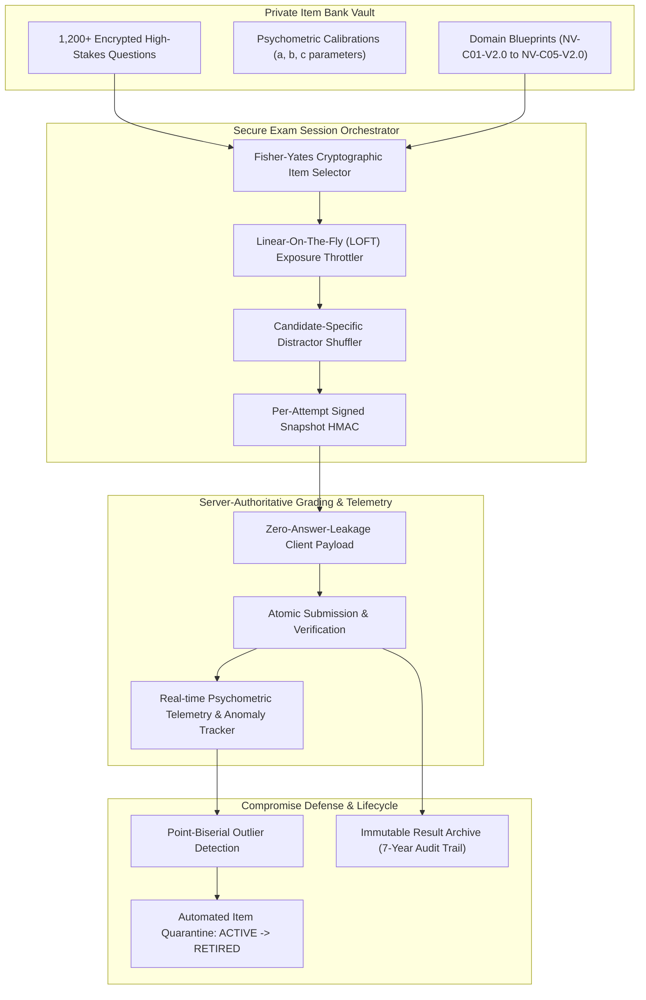

# NetVision — High-Stakes Certification Architecture & Question Pool Governance

**Document Version**: 1.0.0 (Production Release)  
**Classification**: Architectural Design & Psychometric Strategy  
**Security Level**: High-Stakes Exam Security & Integrity Standard  
**Compliance Standards**: ISO/IEC 17024 (General Requirements for Bodies Operating Certification of Persons), NCCA Standards for the Accreditation of Certification Programs, SOC 2 Type II Examination Security Controls.

---

## 1. Executive Summary & Problem Formulation

NetVision currently operates a unified assessment bank of **229 authoritative questions** (derived from the *CS-221 Computer Networking Textbook*). These questions serve dual purposes:
1. **Formative Practice Assessment**: In-lesson checks and end-of-module review quizzes.
2. **Summative Certification Assessment**: Theory exams for the 5 Flagship Courses (`NV-NET-C01` to `NV-NET-C05`) and Master Capstone qualification.

### The High-Stakes Problem
High-stakes professional credentials (e.g., CCNA, AWS Certified Solutions Architect, CISSP) demand that an earned certificate represents **true demonstrated technical competence**, not question memorization. Because NetVision is an open-source educational codebase hosted in public GitHub, committing question pools, answer keys, and grading rubrics directly to git creates a fundamental security contradiction:

> **Core Conflict**: Open-source educational transparency empowers learners, but storing summative assessment pools in public git makes brain-dumping trivial and destroys high-stakes credential credibility.

This document audits the current assessment architecture, calculates exact exposure and compromise risks, specifies the target two-tier item banking architecture, and provides a zero-breaking migration plan.

---

## 2. Current Architecture Audit

```mermaid
graph TD
    A["assessment-question-bank.ts<br/>(229 questions in public git)"] -->|Prisma Seed| B["PostgreSQL: quiz_questions<br/>(Contains correctOption & explanations)"]
    B -->|topics.service: getQuizById| C["Sanitized Module Quizzes<br/>(Formative: 3-5 items/lesson)"]
    B -->|certifications.service: buildTheoryExamBlueprint| D["50-Question Blueprint<br/>(Summative Exam Attempt)"]
    D -->|Sanitized Client Payload| E["Candidate Browser<br/>(Answers stripped)"]
    E -->|Submit Answers {qId: optIndex}| F["Server-Authoritative Evaluation<br/>(Atomic CAS Grade Computation)"]
    F -->|Passed >=80%| G["Immutable Certificate Issuance<br/>(SHA-256 Digest in DB)"]
```

### 2.1 Storage & Code Paths
- **Source of Truth**: `backend/src/topics/assessment-question-bank.ts` (5,287 lines, 229 questions stored as TypeScript constants in plaintext).
- **Database Model**: `QuizQuestion` table in PostgreSQL:
  ```prisma
  model QuizQuestion {
    id               String         @id @default(uuid())
    quizId           String
    questionText     String
    optionsJson      Json           // Array of 4 option strings
    correctOption    Int            // Index of correct option (0-3)
    explanation      String?
    explanationsJson Json?
    cognitiveLevel   CognitiveLevel @default(UNDERSTANDING)
    questionType     QuestionType   @default(MULTIPLE_CHOICE)
    concept          String?
    difficulty       CourseLevel    @default(BEGINNER)
    points           Int            @default(10)
  }
  ```
- **Blueprint Selection**: In `certifications.service.ts` (`buildTheoryExamBlueprint`):
  - Fetches `this.prisma.quizQuestion.findMany({ take: 200 })`.
  - Classifies questions on-the-fly into 5 heuristic domains: `CONCEPTUAL` (8 items), `MECHANICS` (12 items), `NUMERICAL` (10 items), `PACKET_ANALYSIS` (10 items), `TROUBLESHOOTING` (10 items).
  - Selects 50 items using `array.sort(() => Math.random() - 0.5)`.
- **Master Capstone Storage**:
  - `backend/src/certifications/capstone-assessment/capstone-v1.content.ts`: Contains 40 theory questions, 35 incident scenarios, and 25 forensics scenarios in plaintext.

### 2.2 Current Security Strengths
1. **Server-Authoritative Grading**: The client browser *never* receives `correctOption`, `explanation`, or `explanationsJson` during an active exam sitting. `sanitizeQuestionsForClient()` strips all scoring keys.
2. **CAS Atomic Submission Locking**: `exam_attempts` uses atomic Compare-And-Swap (`updateMany` with `status: IN_PROGRESS`) to prevent duplicate submission settlement or double-minting.
3. **Timed Server Sessions**: Server strictly enforces expiry timestamps (`expiresAt`); expired submissions are automatically rejected.

---

## 3. Risk & Vulnerability Analysis

### Risk 1: Public Source Code Exposure (The "Brain-Dump" Hazard)
- **Severity**: **CRITICAL**
- **Mechanics**: Because `assessment-question-bank.ts` and `capstone-v1.content.ts` are committed to GitHub, any student can clone the repository, run a 3-line Python script to extract all questions and correct answer indices, and pass any certification exam with 100% without understanding a single networking concept.

### Risk 2: Extreme Item Pool Depletion & Exposure Rate
- **Severity**: **HIGH**
- **Mathematical Reality**:
  - Total Question Pool: $N = 229$.
  - Exam Question Count: $k = 50$.
  - Single-Sitting Exposure Rate:
    $$\text{Exposure Rate} = \frac{k}{N} = \frac{50}{229} \approx 21.83\%$$
  - Probability of a candidate seeing a question they previously saw upon their 2nd attempt:
    $$P(\text{overlap}) = 1 - \frac{\binom{229 - 50}{50}}{\binom{229}{50}} \approx 99.98\%$$
  - Expected overlap: $\approx 10.9$ duplicate questions on attempt 2, and $\approx 21$ duplicate questions by attempt 3.
  - **Standard**: High-stakes programs mandate pools of $\ge 1,500$ calibrated items with exposure caps $\le 10\%$.

### Risk 3: Static, Deterministic Practical Scenarios
- **Severity**: **HIGH**
- **Mechanics**: In the Master Capstone, troubleshooting incidents use static IPs (e.g., `192.168.10.1`), fixed switch ports (`Gig0/1`), and fixed MTU mismatch values (`1400` vs `1500`). Once a single student documents the solution sequence on a forum, the practical exam becomes a rote copy-paste exercise.

### Risk 4: Lack of Psychometric Telemetry & Quality Calibration
- **Severity**: **MEDIUM**
- **Mechanics**: The system currently does not compute Item Response Theory (IRT) parameters:
  - **Item Difficulty ($p$-value)**: Proportion of test-takers answering correctly.
  - **Point-Biserial Correlation ($r_{pb}$)**: Discrimination power (whether high-ability candidates get the item right and low-ability candidates get it wrong).
  - **Distractor Efficiency**: Whether all 3 incorrect options attract lower-performing candidates equally or if 2 options are obvious throwaways.

### Risk 5: Non-Cryptographic Randomization
- **Severity**: **MEDIUM**
- **Mechanics**: Current shuffling uses `Math.random() - 0.5`. V8's `Math.random()` (xorshift128+) is not cryptographically secure, introduces modulo bias, and cannot be audited against seed replay attacks.

---

## 4. Question Separation Governance: Public vs Private

To reconcile open-source pedagogy with high-stakes integrity, NetVision must partition content into **two distinct operational tiers**:

```
┌─────────────────────────────────────────────────────────────────────────────┐
│                       NETVISION ITEM GOVERNANCE                             │
├──────────────────────────────────────┬──────────────────────────────────────┤
│    TIER 1: PUBLIC FORMATIVE BANK     │    TIER 2: PRIVATE SUMMATIVE VAULT   │
│   (Open-Source in Public GitHub)     │     (Confidential & KMS-Encrypted)   │
├──────────────────────────────────────┼──────────────────────────────────────┤
│ • 229 Current Textbook Questions     │ • 1,200+ Calibrated High-Stakes Items│
│ • Lesson Knowledge Checks (3-5/lsn)  │ • Final Certification Theory Exams   │
│ • Module Practice Quizzes            │ • Master Capstone Incidents          │
│ • Interactive Analogy Explorers      │ • Variable Practical Rubrics         │
│ • Community-contributed questions    │ • Formal psychometric parameters     │
│ • Licensed under CC BY-SA / MIT      │ • Proprietary & Confidential         │
│ • Strictly EXCLUDED from final exams │ • Strictly EXCLUDED from open git    │
└──────────────────────────────────────┴──────────────────────────────────────┘
```

### 4.1 Questions Permitted in Public GitHub
- **All Formative Practice Questions (Current 229 questions)**:
  - Used for learning reinforcement during lesson reading.
  - Students are encouraged to inspect, study, debate, and improve them via pull requests.
  - Answers and full multi-distractor explanations remain visible to maximize educational understanding.

### 4.2 Questions Prohibited in Public GitHub (Private Vault)
- **All Summative Certification Questions**:
  - Questions that count toward accredited or verified credentials (`NV-NET-C01` to `NV-NET-C05` and `NV-NET-MASTERY`).
  - Capstone incident scripts, hidden fault injection triggers, and packet trace pcap answer vectors.
  - Must live in a private repository, AWS KMS-encrypted asset bundle, or private DB schema accessible only to backend production runners.

---

## 5. Target High-Stakes Architecture



### 5.1 Versioned Exam Blueprints
Each certification track operates an immutable, versioned blueprint specifying exact domain weights, difficulty targets, and cognitive taxonomies:

```json
{
  "blueprintId": "BLUEPRINT-NV-NET-C01-V2.0",
  "totalItems": 50,
  "passingScore": 80,
  "timeLimitMinutes": 75,
  "domains": [
    { "domainId": "PHYSICAL_MEDIA", "name": "Physical Layer & Media", "weightPct": 20, "targetCount": 10 },
    { "domainId": "ETHERNET_FRAMING", "name": "Ethernet & Data Link", "weightPct": 25, "targetCount": 13 },
    { "domainId": "IP_ADDRESSING", "name": "IPv4 & IPv6 Addressing", "weightPct": 25, "targetCount": 12 },
    { "domainId": "TCP_UDP_TRANSPORT", "name": "Transport Protocols", "weightPct": 15, "targetCount": 8 },
    { "domainId": "DIAGNOSTICS", "name": "Physical Layer Triage", "weightPct": 15, "targetCount": 7 }
  ],
  "cognitiveDistribution": {
    "RECALL": { "maxPct": 15 },
    "UNDERSTANDING": { "targetPct": 30 },
    "APPLICATION": { "targetPct": 35 },
    "TROUBLESHOOTING": { "targetPct": 20 }
  }
}
```

### 5.2 Cryptographically Secure Randomization & Option Shuffling
Instead of biased `Math.random()`, the exam assembly engine employs **Fisher-Yates Cryptographic Shuffle** driven by `crypto.randomInt`:
1. **Item Selection**: Items selected per domain pool using Linear-On-The-Fly (LOFT) sampling.
2. **Distractor Permutation**: The 4 choices for each question are shuffled uniquely for each attempt. Option index `0` for Candidate A becomes option `2` for Candidate B.
3. **Session HMAC**: The entire generated test sequence is serialized, timestamped, and hashed using a server-side HMAC key (`crypto.createHmac('sha256', SECRET)`). Any tamper attempts against the snapshot invalidate the exam sitting.

### 5.3 Item Exposure Tracking & Rotation Rules
To prevent question pool burnout:
- **Maximum Exposure Cap ($E_{max}$)**: No individual question may appear on more than **15% of active exam attempts** within any rolling 30-day window.
- **Exposure Metric**:
  $$E_i = \frac{\text{Attempts featuring item } i \text{ in last 30d}}{\text{Total attempts in last 30d}}$$
- If $E_i \ge 0.15$, the item selector temporarily removes item $i$ from active rotation until fresher items balance the distribution.

### 5.4 Automated Compromise & Brain-Dump Detection
A sudden compromise (e.g. answer key published online) produces distinct statistical anomalies:
1. **$p$-Value Jump**: Item difficulty metric jumps from $p = 0.48$ to $p = 0.98$ within 48 hours.
2. **Point-Biserial Collapse ($r_{pb} < 0.10$)**: Low-scoring candidates answer the question correctly at the same or higher rate than high-scoring candidates.
3. **Response Time Anomaly**: Candidates answering complex multi-step subnetting or packet analysis questions in under 4 seconds.

When an anomaly triggers:
```
[ANOMALY TRIGGER] ──> Status: FLAGGED_FOR_REVIEW
                           │
                 Auto-Quarantine (Exposure = 0)
                           │
             Replacement Drawn from Reserve Pool
                           │
                 Psychometric SME Review
              ┌────────────┴────────────┐
          RETIRED (Burned)         RESTORED (False Alarm)
```

---

## 6. Phased Zero-Breaking Migration Plan

```
Phase 1: Baseline Hardening (Current Release)
├── Create High-Stakes Architecture Specification (docs/HIGH_STAKES_CERTIFICATION_ARCHITECTURE.md)
├── Introduce Non-Breaking TypeScript Interfaces (high-stakes.interface.ts)
├── Implement Cryptographic Fisher-Yates & Option Shuffler (exam-crypto.util.ts)
└── Maintain 229 questions for beta testing with zero client answer leakage.

Phase 2: Item Vault Isolation & Repository Decoupling (Next Release)
├── Designate current 229 questions as permanent Public Formative Practice Bank.
├── Provision private, encrypted Item Vault (1,000+ items across 5 domains).
├── Implement CI/CD encrypted seed pipeline (zero private items committed to public git).
└── Decouple exam blueprint builder from public quiz_questions table.

Phase 3: Psychometric Engine & Automated Anomaly Quarantine
├── Add ItemResponseTelemetry model in PostgreSQL (attempts, correctCount, timeSpentMs).
├── Compute daily p-values and point-biserial correlations in background worker.
└── Deploy automated quarantine alert rule in MonitoringService.

Phase 4: Dynamic Variable-Topology Practical Lab Engine
├── Replace static Capstone IP subnets with procedural RFC 1918 allocations.
├── Seed variable MTU, VLAN, and ACL fault states per attempt.
└── Grade against reachability and protocol convergence rather than static strings.
```

---

## 7. Concrete Answers to Strategic Audit Questions

| Strategic Audit Question | Operational Determination & Policy |
| :--- | :--- |
| **Which questions can safely live in public GitHub?** | The **229 formative practice questions** currently in `assessment-question-bank.ts`. They represent learning aids, in-lesson knowledge checks, and open curriculum materials. |
| **Which questions must be strictly private?** | All **summative certification questions** and final exam pools. They must live in a private KMS-encrypted vault and never be committed to public git. |
| **Where do grading-sensitive rubrics live?** | In server-only private assessment modules (`master-capstone.service.ts` evaluation algorithms), evaluated exclusively behind atomic server transactions. |
| **How are production question pools versioned?** | Via semantic versioned blueprint specifications (`BLUEPRINT-NV-NET-C01-V2.0`), signed with cryptographic digest manifests. |
| **How do questions rotate?** | Using Linear-On-The-Fly Testing (LOFT) with a strict **15% maximum exposure cap** over rolling 30-day windows. |
| **How are compromised questions retired?** | Automatically quarantined when point-biserial correlation drops ($r_{pb} < 0.10$) or $p$-value spikes ($> 0.95$), then replaced with reserve items. |
| **How are exam blueprints protected?** | Stored in private configuration schemas; compiled into per-attempt ephemeral snapshots signed with session HMACs. |
