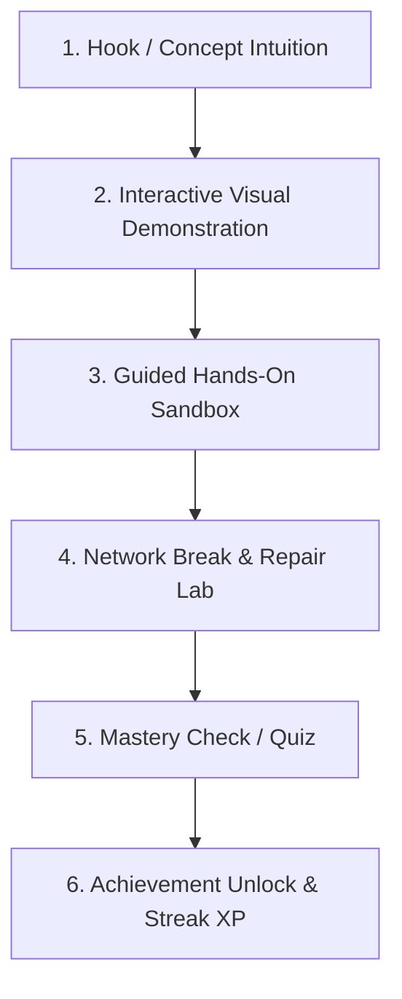

# NetVision Original Pedagogical & Learning Mechanics Blueprint

> **Mission**: Build the world's most intuitive, visual, and engaging computer networking platform by synthesizing the best interactive learning paradigms into a completely original experience.

---

## 🎯 Benchmark Principles Analysis

| Product Inspiration | Key Learning Principle Extracted | NetVision Original Synthesis |
|---|---|---|
| **Packet School** | Interactive networking visuals & hands-on packet flows | **Visual Packet Inspector**: Real-time packet movement with step-by-step layer unpacking (L2 MAC, L3 IP, L4 Port). |
| **Duolingo** | Daily streaks, bite-sized lessons, instant feedback loop | **NetVision Mastery Loop**: 5-minute bite-sized lessons with streak counters, XP points, and instant visual validation for every action. |
| **Brilliant.org** | Guided problem solving & intuition building | **Interactive Concept Challenges**: Instead of reading text, users manipulate nodes/switches to discover how ARP resolves MAC addresses. |
| **Cisco Packet Tracer** | Physical topology representation & cabling | **Visual Sandbox Lab**: Drag-and-drop networking devices with intuitive cable snapping and real-time packet dispatch. |
| **Excalidraw** | Ultra-fluid canvas interaction with zero friction | **Gesture-First Canvas**: Smooth panning, pinch-to-zoom, and dynamic magnetic cable connections. |
| **Figma** | High-density property inspection & clean UI | **Node Property Drawer**: Sleek glassmorphic property panels for IP, MAC, Subnet, and Routing table configuration. |
| **Linear** | Lightning fast, dark mode, keyboard shortcuts | **Keyboard Navigation**: Press `P` to dispatch Ping packet, `Space` to play/pause simulation tick loop. |
| **Stripe** | World-class dark aesthetics, gradients, typography | **NetVision Visual System**: Glowing cyan/blue packet paths, glassmorphic cards, crisp JetBrains Mono packet data formatting. |

---

## 🎓 The NetVision 6-Step Pedagogical Loop

Every lesson in NetVision follows a strict, highly engaging 6-step interactive learning sequence:

### Step 1: Hook / Concept Intuition (1 Minute)
- **Objective**: Spark curiosity before presenting theory.
- **Example**: "Why can't Computer A send a message to Computer B across the world using just a MAC address?"
- **Interaction**: User clicks a button to attempt sending a MAC frame across 3 routers — watches it fail — discovering the need for IP Routing.

### Step 2: Interactive Visual Demonstration (2 Minutes)
- **Objective**: Teach the concept through interactive animation.
- **Interaction**: User scrubs a 60 FPS timeline player to watch an ARP Request broadcast packet flood a switch until the target server replies with a unicast ARP Reply.

### Step 3: Guided Hands-On Sandbox (2 Minutes)
- **Objective**: Build mental models by doing.
- **Interaction**: User drags a Switch between PC1 and PC2, connects Ethernet cables, and dispatches a test packet.

### Step 4: Network Break & Repair Lab (2 Minutes)
- **Objective**: Deepen understanding through troubleshooting.
- **Interaction**: "The DNS lookup for google.com is failing! Inspect the router configuration and fix the broken subnet mask."

### Step 5: Mastery Check / Interactive Quiz (1 Minute)
- **Objective**: Reinforce retention with instant visual feedback.
- **Interaction**: Drag-and-drop packet header fields into the correct OSI layer order. Instant green glow on success.

### Step 6: Achievement Unlock & Gamification
- **Objective**: Reward progress and build daily learning habits.
- **Interaction**: Level up XP progress bar, update daily streak, unlock "Packet Master" badge.

---

## 🚀 Key Differentiators of NetVision

1. **Zero Text Wall Policy**: No lesson contains more than 2 paragraphs of uninterrupted text. All concepts are demonstrated visually.
2. **Interactive Packet Inspection**: Clicking any moving packet pauses time and displays a 3D glass breakdown of its frame, IP header, and payload.
3. **Instant Visual Feedback**: Wrong configurations glow subtle rose/amber with an intuitive diagnostic hint; correct configurations glow electric cyan.
4. **Accessible to Complete Beginners**: Zero prior command line or networking experience required.
