# NetVision — Master Sitemap & Information Architecture Specification

> **Version**: 1.0.0-SITEMAP  
> **Status**: APPROVED  
> **Target Domain**: `https://netvision-three.vercel.app`  
> **Framework**: Next.js 14 App Router  
> **Last Updated**: 2026-09-07

---

## 1. High-Level Platform Architecture & Visual Sitemap

The NetVision platform is organized into **9 distinct functional zones**, balancing public course discovery, interactive laboratory instruments, server-authoritative assessments, and authenticated learner workspaces.

```mermaid
graph TD
    Root["🌐 NetVision Root (/)"] --> Discovery["1. Discovery & Public Hub"]
    Root --> Curriculum["2. Curriculum & Lesson Studio"]
    Root --> Interactive["3. Simulations & Workbench"]
    Root --> Troubleshooting["4. Break-Fix Troubleshooting"]
    Root --> Certification["5. Exams & Credentials"]
    Root --> Knowledge["6. Reference & Study Tools"]
    Root --> Learner["7. Learner Command Center"]
    Root --> Admin["8. Platform Administration"]
    Root --> Auth["9. Authentication & Security"]

    %% Zone 1
    Discovery --> Home["/"]
    Discovery --> Docs["/docs"]
    Docs --> Arch["/docs/architecture"]
    Docs --> DesignSys["/docs/design-system"]
    Docs --> Pedagogy["/docs/pedagogy-blueprint"]

    %% Zone 2
    Curriculum --> CoursesCatalog["/courses"]
    CoursesCatalog --> CourseDetail["/courses/[slug] (16 Courses)"]
    CourseDetail --> LessonStudio["/courses/[slug]/lessons/[lessonSlug]"]

    %% Zone 3
    Interactive --> SimHub["/simulations"]
    Interactive --> SandboxLab["/sandbox"]
    Interactive --> WorkbenchLab["/workbench"]
    Interactive --> GuidedLabs["/labs"]

    %% Zone 4
    Troubleshooting --> IncidentsCatalog["/troubleshooting"]
    IncidentsCatalog --> IncidentLab["/troubleshooting/[slug] (12 Incidents)"]

    %% Zone 5
    Certification --> ExamsCatalog["/exams"]
    Certification --> Challenges["/challenges"]
    Certification --> CertsDir["/certificates"]
    Certification --> CertDetail["/certificates/[id]"]
    Certification --> VerifyPortal["/certificates/verify/[credentialId]"]

    %% Zone 6
    Knowledge --> Commands["/commands"]
    Knowledge --> Glossary["/glossary"]
    Knowledge --> Flashcards["/flashcards"]

    %% Zone 7
    Learner --> Dashboard["/dashboard"]
    Learner --> Profile["/profile"]
    Learner --> Achievements["/achievements"]
    Learner --> Settings["/settings"]

    %% Zone 8
    Admin --> AdminDashboard["/admin"]

    %% Zone 9
    Auth --> Login["/login"]
    Auth --> Register["/register"]
    Auth --> VerifyOTP["/register/verify-otp"]
    Auth --> ForgotPwd["/forgot-password"]
    Auth --> ResetPwd["/reset-password"]
    Auth --> Callback["/auth/callback"]
```



---

## 2. Complete Route Inventory & Technical Metadata

| Route Path | Page Title | Access Level | Rendering Mode | Change Frequency | SEO Priority | Key Components |
| :--- | :--- | :--- | :--- | :--- | :--- | :--- |
| `/` | NetVision — Interactive Networking Platform | Public / Guest | SSR + Interactive Canvas | Daily | `1.0` | Hero3D, LiveTerminal, CourseRail, CTA |
| `/courses` | Master Curriculum Catalog | Public / Guest | SSR + Client Filter | Daily | `0.9` | CourseGrid, LevelFilter, ProgressPills |
| `/courses/[slug]` | Course Overview & Syllabus | Public / Guest | Dynamic SSR / Client | Weekly | `0.8` | SyllabusAccordion, ModuleCard, PrereqModal |
| `/courses/[slug]/lessons/[lessonSlug]` | Interactive Lesson Studio | Public Preview / Auth | Client Interactive | Weekly | `0.8` | LessonViewer, ProtocolInstrument, QuizEngine |
| `/troubleshooting` | Network Incident & Break-Fix Catalog | Public / Guest | SSR + Client Filter | Daily | `0.9` | IncidentCard, TopologyBadge, DifficultyTag |
| `/troubleshooting/[slug]` | Break-Fix Incident Workbench | Public / Guest | Client Interactive | Weekly | `0.8` | MultiTerminal, PacketSniffer, EvidenceLog |
| `/simulations` | Protocol Simulator & Instruments Hub | Public / Guest | SSR + Client Grid | Weekly | `0.9` | InstrumentGrid, SubnetSlider, ArpVisualizer |
| `/sandbox` | Freeform Topology Drag-and-Drop Lab | Public / Guest | Client Canvas / Flow | Weekly | `0.85` | ReactFlowCanvas, DevicePalette, PacketFlow |
| `/workbench` | Protocol Analysis & Packet Workbench | Public / Guest | Client Interactive | Weekly | `0.85` | PacketInspector, HexViewer, FilterBar |
| `/labs` | Guided Hands-On Lab Catalog | Public / Guest | SSR + Client Filter | Weekly | `0.85` | LabCards, StepByStepRunner, TopologyPreview |
| `/challenges` | Time-Trial Network Diagnostic Drills | Public / Guest | Client Interactive | Weekly | `0.7` | ChallengeTimer, AnomalyScoring, Scoreboard |
| `/exams` | Benchmark & Certification Exams | Public / Guest | Client Assessment | Weekly | `0.8` | ExamEngine, TimerGuard, ResultSummary |
| `/commands` | Network CLI Reference & Terminal Engine | Public / Guest | SSR + Client Search | Weekly | `0.8` | CommandSearch, OSSelector, OutputSimulator |
| `/glossary` | RFC & Networking Terminology Encyclopedia | Public / Guest | SSR + Alphabet Index | Weekly | `0.7` | TermSearch, RFCReference, ConceptCrossLink |
| `/flashcards` | Spaced Repetition Networking Cards | Public / Guest | Client Interactive | Weekly | `0.7` | FlashcardDeck, MasteryFlip, SRSAlgorithm |
| `/certificates` | Certified Engineers & Credentials | Authenticated / Public | Client Catalog | Weekly | `0.7` | CertificateCard, CredentialBadge, ShareModal |
| `/certificates/[id]` | Certificate View & PDF Export | Authenticated / Public | Client Dynamic | Monthly | `0.5` | PrintableCert, VerificationQR, ShareActions |
| `/certificates/verify/[credentialId]` | Cryptographic Credential Verification | Public / Universal | SSR Dynamic Verify | Daily | `0.8` | CryptographicVerifier, SignatureAudit |
| `/docs` | NetVision Documentation Center | Public | SSR Static | Weekly | `0.7` | DocsNav, MarkdownRenderer, SearchIndex |
| `/docs/architecture` | System Architecture Blueprint | Public | SSR Static | Monthly | `0.6` | MermaidDiagrams, ServiceTopology, Caching |
| `/docs/design-system` | Cyber-Tactical Design Specifications | Public | SSR Static | Monthly | `0.6` | ColorTokens, TypographyGuide, Icons |
| `/docs/pedagogy-blueprint` | Pedagogical Architecture & Framework | Public | SSR Static | Monthly | `0.6` | BloomTaxonomy, CognitiveScaffolding |
| `/dashboard` | Learner Command Center | Authenticated User | Client Dashboard | Hourly | `0.0` (Disallowed) | ProgressChart, StreakTracker, QuickResume |
| `/profile` | Learner Public & Private Profile | Authenticated User | Client Profile | Daily | `0.0` (Disallowed) | SkillRadar, ActivityGraph, BadgesGrid |
| `/achievements` | Milestone Badges & Accomplishments | Authenticated User | Client Badges | Weekly | `0.0` (Disallowed) | BadgeLocker, MilestoneProgress, TierTrophies |
| `/settings` | User Account & Preferences | Authenticated User | Client Settings | Monthly | `0.0` (Disallowed) | ProfileEditor, NotificationPrefs, Security |
| `/admin` | Administrative Management Portal | Role: Admin | Client Admin Portal | Daily | `0.0` (Disallowed) | ContentCMS, IncidentEditor, UserAudit |
| `/login` | Learner Authentication | Public / Guest | Client Form | Monthly | `0.0` (Disallowed) | LoginForm, SocialOAuth, GuestConvert |
| `/register` | Learner Account Registration | Public / Guest | Client Form | Monthly | `0.0` (Disallowed) | RegisterForm, PasswordStrength, TOS |
| `/register/verify-otp` | 2FA / Email OTP Verification | Public / Guest | Client Form | Never | `0.0` (Disallowed) | OTPInput, ResendCountdown |
| `/forgot-password` | Password Recovery Initiation | Public / Guest | Client Form | Monthly | `0.0` (Disallowed) | EmailRequestForm, RateLimiter |
| `/reset-password` | Password Reset Execution | Public / Token | Client Form | Never | `0.0` (Disallowed) | PasswordResetForm, TokenValidator |
| `/auth/callback` | OAuth Provider Callback Handler | Public / Redirect | Client Redirect | Never | `0.0` (Disallowed) | OAuthReceiver, TokenPersister |

---

## 3. Dynamic Resource Slugs

### 3.1. Master 16-Course Progressive Curriculum (`/courses/[slug]`)

The core curriculum spans 4 progressive mastery levels from binary fundamentals to edge infrastructure and packet forensics:

```
Level 0: Digital & Hardware Foundations
├── net-101-digital-foundations        Computer & Digital Information Foundations
├── net-102-network-fundamentals       Networking Fundamentals & Architectures
└── net-103-reference-models           OSI 7-Layer & TCP/IP 4-Layer Reference Models

Level 1: Local & IP Infrastructure
├── net-201-layer2-ethernet            Layer 2 Ethernet & Switching Essentials
├── net-202-ipv4-subnetting            IPv4 Addressing & VLSM/CIDR Subnetting
├── net-203-core-ip-services           Core IP Services (DNS, DHCP, ARP, ICMP)
└── net-204-transport-protocols        Transport Layer Mechanics (TCP & UDP)

Level 2: Enterprise Campus & Routing
├── net-301-switching-vlans            VLANs, Trunking (802.1Q) & Inter-VLAN Routing
├── net-302-spanning-tree              Spanning Tree Protocol (STP) & Loop Prevention
├── net-303-static-routing             IP Routing Mechanics & Static Routes
├── net-304-dynamic-routing-ospf       Dynamic Routing via Single-Area OSPF
└── net-305-acls-firewalls             Network Security: ACLs & Stateful Firewalls

Level 3: Edge, WAN & Security Operations
├── net-401-nat-pat                    IPv4 Address Exhaustion & NAT/PAT Operations
├── net-402-vpn-crypto                 Site-to-Site & Remote Access IPsec VPNs
├── net-403-network-automation         Modern Network Programmability & Python Netmiko
└── net-404-packet-analysis            Deep Packet Forensics & Wireshark Dissection
```

---

### 3.2. Troubleshooting Incident Scenarios (`/troubleshooting/[slug]`)

Each incident models real-world corporate enterprise outages, isolating protocol anomalies across Layers 1–7:

1. `dns-resolution-failure`: Internal resolver timeout & recursive DNS loop
2. `dhcp-failure`: DHCP exhaustion & rogue DHCP server scope conflict
3. `incorrect-subnet-mask`: Off-subnet gateway unreachable due to CIDR mismatch
4. `arp-resolution-failure`: ARP cache poisoning and gratuitous ARP anomaly
5. `vlan-mismatch`: Trunk native VLAN mismatch causing frame leakage
6. `stp-loop-blocking-issue`: BPDU filter misconfiguration & broadcast storm
7. `ospf-neighbor-problem`: MTU and dead interval mismatch blocking 2-WAY state
8. `incorrect-routing-table`: Suboptimal asymmetric routing & black hole route
9. `packet-loss-duplex-mismatch`: Half/Full duplex negotiation collision on physical link
10. `mtu-mismatch-pmtud-blackhole`: DF bit packet drops inside GRE/IPsec tunnels
11. `high-latency-bufferbloat`: Queuing congestion & excessive TCP buffer latency
12. `tcp-connection-failure`: Silent RST injection & SYN flood mitigation firewall block

---

## 4. Interactive Protocol Instruments & Visualizers

NetVision embeds dedicated interactive instruments across lessons, simulations, and troubleshooting workbenches:

| Instrument Code | Instrument Name | Primary Route Location | Pedagogical Mechanism |
| :--- | :--- | :--- | :--- |
| `INST-BIN-01` | Binary Bit Engine | `/courses/net-101-digital-foundations` | Interactive bit switches with live base-10/16 conversion |
| `INST-CIDR-02` | CIDR Subnet Slider | `/courses/net-202-ipv4-subnetting`, `/simulations` | Real-time network/host bit boundary sliding & range calculation |
| `INST-ARP-03` | ARP Cache State Machine | `/courses/net-203-core-ip-services`, `/simulations` | Packet broadcast vs unicast reply visualization with CAM table sync |
| `INST-TCP-04` | TCP 3-Way Handshake Engine | `/courses/net-204-transport-protocols`, `/simulations` | Interactive SEQ/ACK step progression with sliding window graphs |
| `INST-STP-05` | STP Topology Convergence | `/courses/net-302-spanning-tree`, `/simulations` | Root bridge election, blocking port determination, BPDU exchange |
| `INST-OSPF-06` | OSPF Link-State DB Visualizer | `/courses/net-304-dynamic-routing-ospf`, `/simulations` | Dijkstra Shortest Path First (SPF) tree computation |
| `INST-WIRESHARK-07` | Hex & Frame Dissector | `/courses/net-404-packet-analysis`, `/workbench` | Byte-level packet dissection across Ethernet, IP, and TCP headers |

---

## 5. SEO, Crawl Directives & Sitemap Directives

### 5.1. Dynamic Sitemap Generation (`frontend/app/sitemap.ts`)
- **Base Canonical URL**: `https://netvision-three.vercel.app`
- **Output Feed**: `/sitemap.xml`
- **Included URLs**:
  - Landing & Core Navigation (`/`, `/courses`, `/simulations`, `/sandbox`, `/workbench`, `/labs`, `/troubleshooting`)
  - All 16 Course Landing Pages (`/courses/[slug]`)
  - All 12 Incident Workbenches (`/troubleshooting/[slug]`)
  - Educational Reference Tools (`/commands`, `/glossary`, `/flashcards`, `/challenges`, `/exams`, `/certificates`)
  - Technical Documentation Pages (`/docs`, `/docs/architecture`, `/docs/design-system`, `/docs/pedagogy-blueprint`)
- **Total Indexable URLs**: 48+ Canonical Entries

### 5.2. Crawl Directives (`frontend/app/robots.ts`)
- **Allow List**:
  - `/*` (Public discovery, courses, troubleshooting, simulations, labs, docs)
- **Disallow List** (Protected / Private / State-Bearing):
  - `/dashboard` & `/dashboard/*`
  - `/profile` & `/profile/*`
  - `/settings` & `/settings/*`
  - `/achievements`
  - `/admin` & `/admin/*`
  - `/auth/*`, `/login`, `/register`, `/forgot-password`, `/reset-password`
  - `/api/*` (Backend proxy endpoints)

---

## 6. User Journeys & Navigation Hierarchy

### 6.1. The Public Discovery to Guest Learner Flow
```
Landing Page (/) 
  ➔ Browse Catalog (/courses)
  ➔ Select Starter Course (/courses/net-101-digital-foundations)
  ➔ Launch Lesson 1.1 (/courses/net-101/lessons/intro-to-binary-and-hex)
  ➔ Interact with Binary Bit Engine (Guest Progress saved in LocalStorage)
  ➔ Complete Mastery Assessment
  ➔ Claim Progress & Register Account (/register) ➔ Sync to Postgres DB
```

### 6.2. The Break-Fix Diagnostic Engineer Flow
```
Incident Catalog (/troubleshooting)
  ➔ Filter by Layer / Protocol (e.g. Layer 3 / OSPF)
  ➔ Open Workbench (/troubleshooting/ospf-neighbor-problem)
  ➔ Run CLI Diagnostics ('show ip ospf neighbor', 'ping', 'traceroute')
  ➔ Inspect Wireshark PCAP Packet Trace
  ➔ Identify Root Cause (Dead timer mismatch)
  ➔ Submit Rectification & Validate Convergence
  ➔ Earn XP & Diagnostic Achievement Badge
```

### 6.3. The Master Certification Flow
```
Prerequisite Validation (Complete NET-101 through NET-404)
  ➔ Unlock Benchmark Exam (/exams)
  ➔ Pass Timed Capstone Diagnostic Exam
  ➔ System signs Ed25519 Cryptographic Credential
  ➔ Certificate Issued (/certificates/[id])
  ➔ Public Verification Link Generated (/certificates/verify/[credentialId])
```
