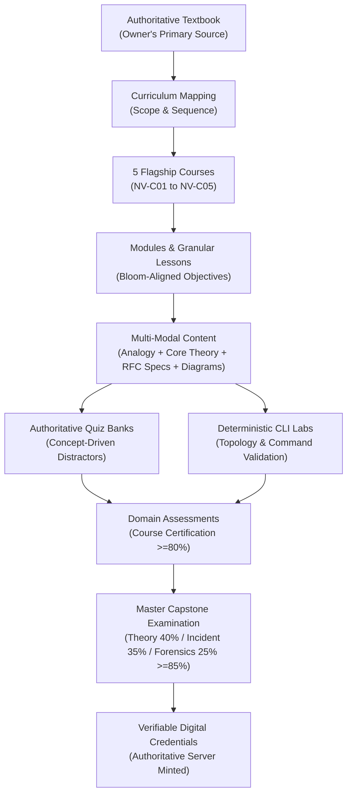

# NetVision Content Source Architecture: Textbook-Grounded Curriculum

## 1. Executive Summary & Educational Vision

A production-grade network engineering learning platform must rest on uncompromising pedagogical rigor. Automated or synthesized filler content degrades academic validity, creates ambiguity in protocol mechanics, and undermines professional certification credibility.

This architecture defines the formal pipeline for establishing the **Owner's English Networking Textbook** as NetVision's single canonical source of truth for theoretical, practical, and assessment content.



---

## 2. The Seven-Tier Content Pipeline

### Tier 1: Canonical Source Ingestion
The textbook is indexed by Chapter, Section, Sub-section, and Concept. Each concept carries:
- Precise protocol definitions (e.g., RFC 791, RFC 8200, RFC 2328).
- Mathematical calculations (e.g., subnet masking, Nyquist/Shannon channel capacity, Dijkstra cost).
- Architectural trade-offs (e.g., Cut-through vs Store-and-Forward switching, Distance-Vector vs Link-State routing).

### Tier 2: Curriculum Mapping & Alignment
Concepts are mapped to the 5 Flagship Professional Certification Courses:
1. **NV-C01: Network Foundations & Physical Layer Architecture**
2. **NV-C02: Internet Protocol & Core Transport Engineering**
3. **NV-C03: Advanced Enterprise Switching & Dynamic Routing Systems**
4. **NV-C04: Network Security, Boundary Defense & Cryptographic Infrastructure**
5. **NV-C05: Telemetry, Observability & Network Programmability**

### Tier 3: Module & Lesson Structuring
Every lesson in the database is re-parented to a specific module and holds strict metadata tracking its chapter source.

### Tier 4: Multi-Modal Explanation Authoring
To ensure high engagement without sacrificing technical depth, every lesson delivers:
- **Analogy**: Real-world cognitive anchor (e.g., postal system, train switching yard).
- **Core Explanation**: Clean, intuitive concept walkthrough.
- **Protocol Engineering**: RFC-level packet headers, bit flags, and state transitions.
- **Interactive Visual Concept**: Packet flow or topology node visualizer.
- **Cheatsheet**: High-yield operational quick-reference table.

### Tier 5: Grounded Assessment Generation
Questions are derived directly from the textbook's problem sets and learning objectives:
- **No Ambiguous Distractors**: Every incorrect option represents a specific, documented learner misconception.
- **Authoritative Explanations**: The `explanation` cites the specific protocol rule, and `explanationsJson` refutes each individual distractor.
- **Balanced Option Distribution**: Correct answers distribute evenly across choices A, B, C, D to eliminate positional guessing strategies.

### Tier 6: Practical CLI Lab Scenarios
Lab exercises mirror the diagnostic scenarios presented in the textbook:
- Deterministic virtual networking environments.
- Objective checklists validating real CLI command syntax (`ping`, `traceroute`, `ip route`, `show ip ospf neighbor`).

### Tier 7: Synoptic Capstone Integration
The cumulative **Master Capstone Examination** evaluates holistic problem-solving across all 5 courses, drawing cross-domain challenges directly from advanced case studies in the textbook.

---

## 3. Source-Traceable Data Schema

To ensure automated traceability, lesson records in Prisma schema support source attribution metadata:

```typescript
export interface TextbookAttribution {
  /** Title of the textbook source */
  bookTitle: string;
  /** Volume / Edition identifier */
  edition: string;
  /** Chapter number */
  chapterNumber: number;
  /** Chapter title */
  chapterTitle: string;
  /** Specific section heading (e.g. "4.3 Subnet Mask Calculation") */
  sectionRef: string;
  /** Page or paragraph reference where applicable */
  citationRef?: string;
  /** Authoritative protocol RFCs or IEEE standards codified */
  standardsRefs: string[];
  /** Bloom's Taxonomy cognitive target */
  cognitiveLevel: 'RECALL' | 'UNDERSTANDING' | 'APPLICATION' | 'ANALYSIS' | 'EVALUATION';
}
```

This attribution is stored directly inside `lesson.contentJson.sourceAttribution`, allowing instructors, auditors, and students to trace every concept to its printed authority.

---

## 4. Ingestion Workflow & Quality Gates

```
[Textbook Chapter]
        │
        ▼
[Pedagogical Extraction] ───► Extract: Terminology, Formulas, Diagrams, Misconceptions
        │
        ▼
[Drafting Phase] ───────────► Author lesson content, 4-option quiz questions, guided lab
        │
        ▼
[Academic Review Gate] ─────► Verify:
                                - 100% factual agreement with textbook
                                - 0% Option A bias across question bank
                                - Valid distractor explanations for every incorrect option
                                - Playable lab validation commands
        │
        ▼
[Production Ingestion] ─────► Seed to Prisma database with cryptographic integrity
```

---

## 5. Phased Roadmap

1. **Phase 1 (Architecture & Schema)**: Define attribution interfaces and validation gates (Completed in this specification).
2. **Phase 2 (Core Flagship Foundations - NV-C01 & NV-C02)**: Ingest Physical, Data Link, IPv4/IPv6, and Transport chapters from the textbook.
3. **Phase 3 (Enterprise Routing & Switching - NV-C03)**: Ingest VLANs, Spanning-Tree, OSPF, and BGP chapters.
4. **Phase 4 (Security & Programmability - NV-C04 & NV-C05)**: Ingest Firewalls, ACLs, IPsec VPNs, Telemetry, and Automation chapters.
5. **Phase 5 (Full Capstone Calibration)**: Calibrate the 120-minute synoptic Capstone against the textbook's comprehensive engineering case studies.
